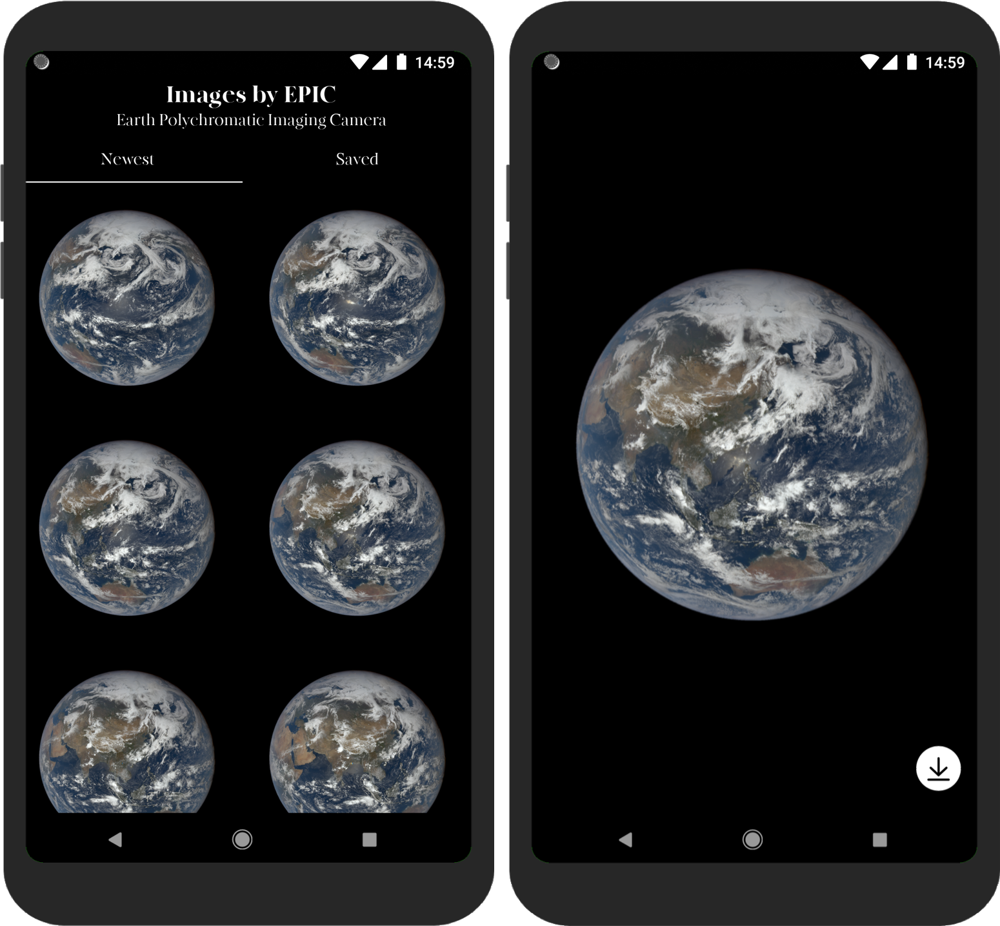

An app build following Android Jetpack best practices.

Screenshots
-----------

Libraries Used
--------------
* [Foundation][0] 
  * [AppCompat][1]
  * [Android KTX][2]
* [Architecture][10]
  * [Data Binding][11]
  * [Lifecycles][12]
  * [LiveData][13]
  * [Navigation][14]
  * [Room][16]
  * [ViewModel][17]
* Third party
  * [Coil][90] 
  * [Kotlin Coroutines][91]
  * [PhotoView][92]
  * [Retrofit][93]
  * [GSON][94]

[0]: https://developer.android.com/jetpack/components
[1]: https://developer.android.com/topic/libraries/support-library/packages#v7-appcompat
[2]: https://developer.android.com/kotlin/ktx
[10]: https://developer.android.com/jetpack/arch/
[11]: https://developer.android.com/topic/libraries/data-binding/
[12]: https://developer.android.com/topic/libraries/architecture/lifecycle
[13]: https://developer.android.com/topic/libraries/architecture/livedata
[14]: https://developer.android.com/topic/libraries/architecture/navigation/
[16]: https://developer.android.com/topic/libraries/architecture/room
[17]: https://developer.android.com/topic/libraries/architecture/viewmodel
[18]: https://developer.android.com/topic/libraries/architecture/workmanager
[30]: https://developer.android.com/guide/topics/ui
[90]: https://github.com/coil-kt/coil](https://github.com/coil-kt/coil)
[91]: https://kotlinlang.org/docs/reference/coroutines-overview.html
[92]: https://github.com/chrisbanes/PhotoView](https://github.com/chrisbanes/PhotoView)
[93]: https://square.github.io/retrofit/](https://square.github.io/retrofit/)
[94]: https://github.com/google/gson](https://github.com/google/gson)

## Rest API (NASA EPIC API)
The EPIC API provides information on the daily imagery collected by DSCOVR's Earth Polychromatic Imaging Camera (EPIC) instrument.
[API Docs](https://api.nasa.gov/index.html#browseAPI)

## What's Next? 
1 . Tests - let's see when that will happened.

License
-------
    Copyright (c) 2016 NomanR.
    
    Licensed under the Apache License, Version 2.0 (the "License");
    you may not use this file except in compliance with the License.
    You may obtain a copy of the License at

       http://www.apache.org/licenses/LICENSE-2.0

    Unless required by applicable law or agreed to in writing, software
    distributed under the License is distributed on an "AS IS" BASIS,
    WITHOUT WARRANTIES OR CONDITIONS OF ANY KIND, either express or implied.
    See the License for the specific language governing permissions and
    limitations under the License.

